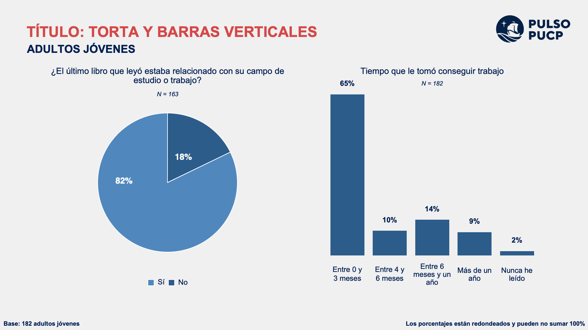
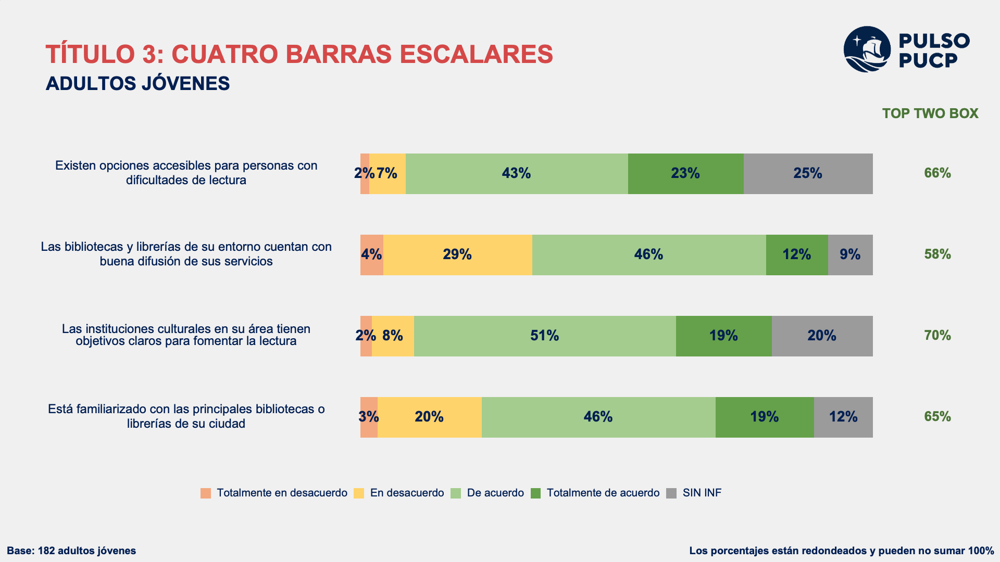
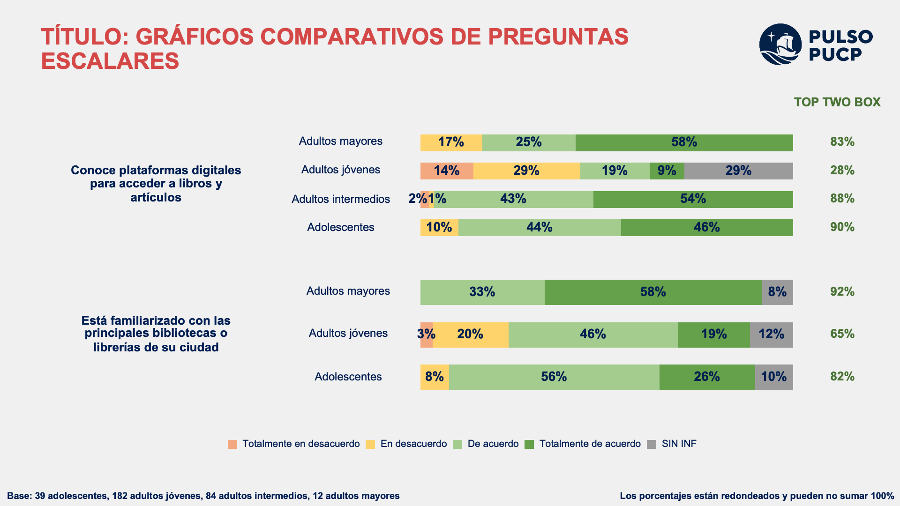

# pulsoreport

<!-- badges: start -->
<!-- badges: end -->

Este paquete tiene como objetivo automatizar la creación de gráficos para reportes de tipo "Acredita" en MS PPT (y próximamente MS Word). Los reportes de tipo "Acredita" siguen el formato comúnmente empleado en los estudios de opinión de distintos públicos de la comunidad universitaria en el marco de los procesos de acreditación o reacreditación de carreras universitarias.

## Instalación

Se puede instalar la versión de desarrollo desde [GitHub](https://github.com/) con:

``` r
# install.packages("devtools")
devtools::install_github("naddc/pulsoreport")
```

## Uso

El paquete contiene una plantilla de PowerPoint desde RMarkdown y bases *dummy* que sirven como ejemplo para usar sus funciones.

## Vista previa de slides

### Diapositiva con gráfico de torta, gráfico de barras y N



### Diapositiva con gráfico escalar


### Diapositiva con gráfico escalar agrupado

